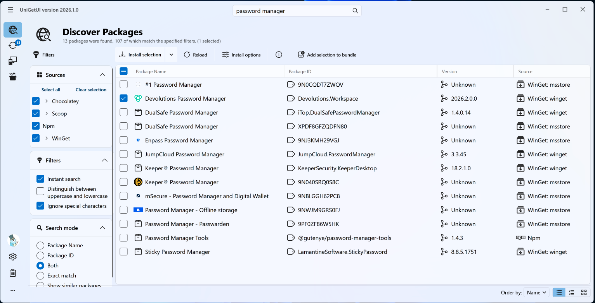
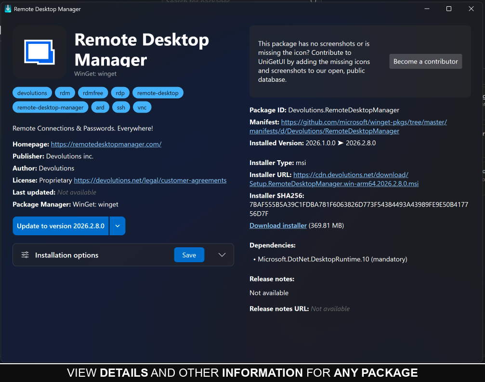
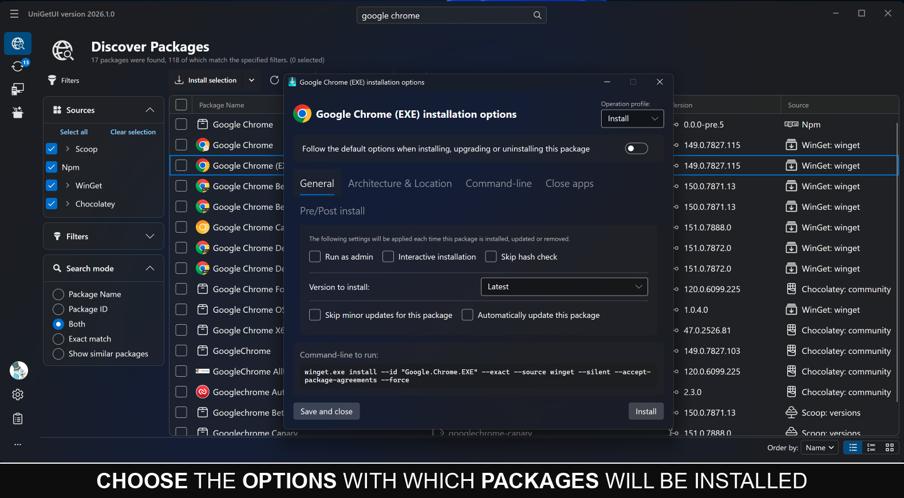
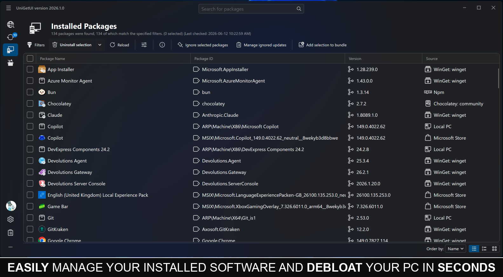
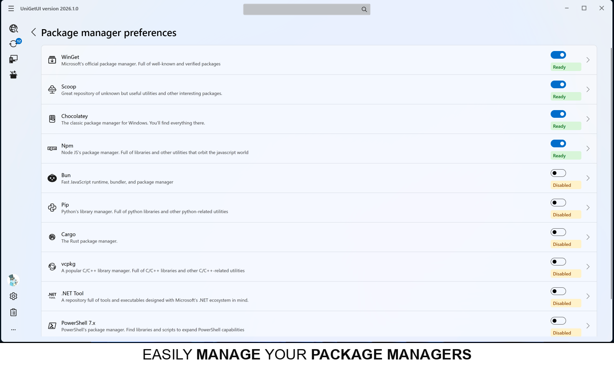

# WARNING: **wingetui<sub>•</sub>com** and **unigetui<sub>•</sub>com** are fake websites hosted by a third-party. please do NOT trust them
<br>

## Devolutions UniGetUI

> [!IMPORTANT]
> **Major announcement:** UniGetUI has entered its next chapter with Devolutions.
> Read the [blog post](https://devolutions.net/blog/2026/03/unigetui-enters-its-next-chapter-with-devolutions/) and the [official press release](https://www.globenewswire.com/news-release/2026/03/10/3253012/0/en/Devolutions-Acquires-UniGetUI-Strengthening-Security-and-Enterprise-Readiness.html).

[](https://github.com/Devolutions/UniGetUI/releases/latest/download/UniGetUI.Installer.exe)
[](https://github.com/Devolutions/UniGetUI/releases)
[](https://github.com/Devolutions/UniGetUI/issues)
[](https://github.com/Devolutions/UniGetUI/issues?q=is%3Aissue+is%3Aclosed)<br>
UniGetUI is an intuitive GUI for the most common CLI package managers on Windows 10 and 11, including [WinGet](https://learn.microsoft.com/en-us/windows/package-manager/), [Scoop](https://scoop.sh/), [Chocolatey](https://chocolatey.org/), [pip](https://pypi.org/), [npm](https://www.npmjs.com/), [.NET Tool](https://learn.microsoft.com/en-us/dotnet/core/tools/dotnet-tool-install), [PowerShell Gallery](https://www.powershellgallery.com/), and more.
With UniGetUI, you can discover, install, update, and uninstall software from multiple package managers through one interface.


View more screenshots [here](#screenshots)

Check out the [Supported Package Managers Table](#supported-package-managers) for more details!

**Disclaimer:** UniGetUI is not affiliated with the package managers it integrates with. Packages are provided by third parties, so review sources and publishers before installation.

<br>


> [!CAUTION]
> **The official website for UniGetUI is [https://devolutions.net/unigetui/](https://devolutions.net/unigetui/).**<br>
> **The official source repository is [https://github.com/Devolutions/UniGetUI](https://github.com/Devolutions/UniGetUI).**<br>
> **Any other website should be considered unofficial, despite what they may say.**

🔒 Found a security issue? Please report it via the [Devolutions security page](https://devolutions.net/security/)

## Project stewardship

UniGetUI was created by Martí Climent and is now maintained by Devolutions. The project remains free, open source, and MIT-licensed. Devolutions' stewardship brings long-term investment, structured governance, stronger security processes, and a roadmap for broader enterprise readiness while keeping UniGetUI standalone and community-driven.

Read more in the [Devolutions announcement](https://devolutions.net/blog/2026/03/unigetui-enters-its-next-chapter-with-devolutions/) and the [official press release](https://www.globenewswire.com/news-release/2026/03/10/3253012/0/en/Devolutions-Acquires-UniGetUI-Strengthening-Security-and-Enterprise-Readiness.html).

## Table of contents
 - **[UniGetUI Homepage](https://devolutions.net/unigetui/)**
 - [Table of contents](#table-of-contents)
 - [Installation](#installation)
 - [Update UniGetUI](#update-unigetui)
 - [Project stewardship](#project-stewardship)
 - [Features](#features)
   - [Supported Package Managers](#supported-package-managers)
 - [Translations](#translations)
 - [Contributors](#contributors)
 - [Screenshots](#screenshots)
 - [Frequently Asked Questions](#frequently-asked-questions)
 - [Command-line Arguments](cli-arguments.md)

## Installation
<p>There are multiple ways to install UniGetUI — choose whichever one you prefer!</p>
 
### Microsoft Store installation (recommended)
<a href="https://apps.microsoft.com/detail/xpfftq032ptphf"></a> 

 
### Download UniGetUI installer:

<p align="left"><b><a href="https://github.com/Devolutions/UniGetUI/releases/latest/download/UniGetUI.Installer.exe">Click here to download UniGetUI</a></b></p>


### Install UniGetUI via WinGet:

```cmd
winget install --exact --id Devolutions.UniGetUI --source winget
```


### Install UniGetUI via Scoop:

```cmd
scoop bucket add extras
scoop install extras/unigetui
```

### Install UniGetUI via Chocolatey:

```cmd
choco install wingetui
```


## Update UniGetUI

UniGetUI has a built-in autoupdater. However, it can also be updated like any other package within UniGetUI (since UniGetUI is available from WinGet, Scoop and Chocolatey).


## Features

 - Install, update, and remove software from your system easily at one click: UniGetUI combines the packages from the most used package managers for windows: Winget, Chocolatey, Scoop, Pip, Npm and .NET Tool.
 - Discover new packages and filter them to easily find the package you want.
 - View detailed metadata about any package before installing it. Get the direct download URL or the name of the publisher, as well as the size of the download.
 - Easily bulk-install, update, or uninstall multiple packages at once selecting multiple packages before performing an operation
 - Automatically update packages, or be notified when updates become available. Skip versions or completely ignore updates on a per-package basis.
 - The system tray icon will also show the available updates and installed packages, to efficiently update a program or remove a package from your system.
 - Easily customize how and where packages are installed. Select different installation options and switches for each package. Install an older version or force to install a 32 bit architecture. \[But don't worry, those options will be saved for future updates for this package*]
 - Share packages with your friends using generated package links.
 - Export custom lists of packages to then import them to another machine and install those packages with previously specified, custom installation parameters. Setting up machines or configuring a specific software setup has never been easier.
 - Backup your packages to a local file to easily recover your setup in a matter of seconds when migrating to a new machine*

## Supported Package Managers

**NOTE:** All package managers do support basic install, update, and uninstall processes, as well as checking for updates, finding new packages, and retrieving details from a package.


✅: Supported on UniGetUI<br>
☑️: Not directly supported but can be easily achieved<br>
⚠️: May not work in some cases<br>
❌: Not supported by the Package Manager<br>
<br>

# Translations

UniGetUI translations are maintained directly in this repository. All supported languages are kept at 100% completion with AI instead of shipping partial translations. If you spot a mistake or want to improve a translation, please open a GitHub issue or submit a pull request.

-  [Afrikaans](src/UniGetUI.Core.LanguageEngine/Assets/Languages/lang_af.json)
-  [Albanian](src/UniGetUI.Core.LanguageEngine/Assets/Languages/lang_sq.json)
-  [Arabic](src/UniGetUI.Core.LanguageEngine/Assets/Languages/lang_ar.json)
-  [Bangla](src/UniGetUI.Core.LanguageEngine/Assets/Languages/lang_bn.json)
-  [Belarusian](src/UniGetUI.Core.LanguageEngine/Assets/Languages/lang_be.json)
-  [Bulgarian](src/UniGetUI.Core.LanguageEngine/Assets/Languages/lang_bg.json)
-  [Catalan](src/UniGetUI.Core.LanguageEngine/Assets/Languages/lang_ca.json)
-  [Croatian](src/UniGetUI.Core.LanguageEngine/Assets/Languages/lang_hr.json)
-  [Czech](src/UniGetUI.Core.LanguageEngine/Assets/Languages/lang_cs.json)
-  [Danish](src/UniGetUI.Core.LanguageEngine/Assets/Languages/lang_da.json)
-  [Dutch](src/UniGetUI.Core.LanguageEngine/Assets/Languages/lang_nl.json)
-  [English](src/UniGetUI.Core.LanguageEngine/Assets/Languages/lang_en.json)
-  [Estonian](src/UniGetUI.Core.LanguageEngine/Assets/Languages/lang_et.json)
-  [Filipino](src/UniGetUI.Core.LanguageEngine/Assets/Languages/lang_fil.json)
-  [Finnish](src/UniGetUI.Core.LanguageEngine/Assets/Languages/lang_fi.json)
-  [French](src/UniGetUI.Core.LanguageEngine/Assets/Languages/lang_fr.json)
-  [Georgian](src/UniGetUI.Core.LanguageEngine/Assets/Languages/lang_ka.json)
-  [German](src/UniGetUI.Core.LanguageEngine/Assets/Languages/lang_de.json)
-  [Greek](src/UniGetUI.Core.LanguageEngine/Assets/Languages/lang_el.json)
-  [Gujarati](src/UniGetUI.Core.LanguageEngine/Assets/Languages/lang_gu.json)
-  [Hebrew](src/UniGetUI.Core.LanguageEngine/Assets/Languages/lang_he.json)
-  [Hindi](src/UniGetUI.Core.LanguageEngine/Assets/Languages/lang_hi.json)
-  [Hungarian](src/UniGetUI.Core.LanguageEngine/Assets/Languages/lang_hu.json)
-  [Indonesian](src/UniGetUI.Core.LanguageEngine/Assets/Languages/lang_id.json)
-  [Italian](src/UniGetUI.Core.LanguageEngine/Assets/Languages/lang_it.json)
-  [Japanese](src/UniGetUI.Core.LanguageEngine/Assets/Languages/lang_ja.json)
-  [Kannada](src/UniGetUI.Core.LanguageEngine/Assets/Languages/lang_kn.json)
-  [Korean](src/UniGetUI.Core.LanguageEngine/Assets/Languages/lang_ko.json)
-  [Lithuanian](src/UniGetUI.Core.LanguageEngine/Assets/Languages/lang_lt.json)
-  [Macedonian](src/UniGetUI.Core.LanguageEngine/Assets/Languages/lang_mk.json)
-  [Norwegian (bokmal)](src/UniGetUI.Core.LanguageEngine/Assets/Languages/lang_nb.json)
-  [Norwegian (nynorsk)](src/UniGetUI.Core.LanguageEngine/Assets/Languages/lang_nn.json)
-  [Persian](src/UniGetUI.Core.LanguageEngine/Assets/Languages/lang_fa.json)
-  [Polish](src/UniGetUI.Core.LanguageEngine/Assets/Languages/lang_pl.json)
-  [Portuguese (Brazil)](src/UniGetUI.Core.LanguageEngine/Assets/Languages/lang_pt_BR.json)
-  [Portuguese (Portugal)](src/UniGetUI.Core.LanguageEngine/Assets/Languages/lang_pt_PT.json)
-  [Romanian](src/UniGetUI.Core.LanguageEngine/Assets/Languages/lang_ro.json)
-  [Russian](src/UniGetUI.Core.LanguageEngine/Assets/Languages/lang_ru.json)
-  [Sanskrit](src/UniGetUI.Core.LanguageEngine/Assets/Languages/lang_sa.json)
-  [Serbian](src/UniGetUI.Core.LanguageEngine/Assets/Languages/lang_sr.json)
-  [Sinhala](src/UniGetUI.Core.LanguageEngine/Assets/Languages/lang_si.json)
-  [Simplified Chinese (China)](src/UniGetUI.Core.LanguageEngine/Assets/Languages/lang_zh_CN.json)
-  [Slovak](src/UniGetUI.Core.LanguageEngine/Assets/Languages/lang_sk.json)
-  [Slovene](src/UniGetUI.Core.LanguageEngine/Assets/Languages/lang_sl.json)
-  [Spanish](src/UniGetUI.Core.LanguageEngine/Assets/Languages/lang_es.json)
-  [Swedish](src/UniGetUI.Core.LanguageEngine/Assets/Languages/lang_sv.json)
-  [Tagalog](src/UniGetUI.Core.LanguageEngine/Assets/Languages/lang_tg.json)
-  [Tamil](src/UniGetUI.Core.LanguageEngine/Assets/Languages/lang_ta.json)
-  [Thai](src/UniGetUI.Core.LanguageEngine/Assets/Languages/lang_th.json)
-  [Traditional Chinese (Taiwan)](src/UniGetUI.Core.LanguageEngine/Assets/Languages/lang_zh_TW.json)
-  [Turkish](src/UniGetUI.Core.LanguageEngine/Assets/Languages/lang_tr.json)
-  [Ukrainian](src/UniGetUI.Core.LanguageEngine/Assets/Languages/lang_ua.json)
-  [Urdu](src/UniGetUI.Core.LanguageEngine/Assets/Languages/lang_ur.json)
-  [Vietnamese](src/UniGetUI.Core.LanguageEngine/Assets/Languages/lang_vi.json)


# Contributions
 UniGetUI wouldn't have been possible without the help of our dear contributors. From the person who fixed a typo to the person who improved half of the code, UniGetUI wouldn't be possible without them! :smile:<br><br>

## Contributors:
 [](https://github.com/Devolutions/UniGetUI/graphs/contributors)<br><br>
 

# Screenshots
 















# Frequently asked questions

**Q: I am unable to install or upgrade a specific Winget package! What should I do?**<br>

A: This is likely an issue with Winget rather than UniGetUI. 

Please check if it's possible to install/upgrade the package through PowerShell or the Command Prompt by using the commands `winget upgrade` or `winget install`, depending on the situation (for example: `winget upgrade --id Microsoft.PowerToys`). 

If this doesn't work, consider asking for help at [Winget's project page](https://github.com/microsoft/winget-cli).<br>

#

**Q: The name of a package is trimmed with ellipsis — how do I see its full name/id?**<br>

A: This is a known limitation of Winget. 

For more details, see this issue: https://github.com/microsoft/winget-cli/issues/2603.<br>

#

**Q: My antivirus is telling me that UniGetUI is a virus! / My browser is blocking the download of UniGetUI!**<br>

A: A common reason apps (i.e., executables) get blocked and/or detected as a virus — even when there's nothing malicious about them, like in the case of UniGetUI — is because a relatively large amount of people are not using them.

Combine that with the fact that you might be downloading something recently released, and blocking unknown apps is in many cases a good precaution to take to prevent actual malware.

Since UniGetUI is open source and safe to use, whitelist the app in the settings of your antivirus/browser.<br>

#

**Q: Are Winget/Scoop packages safe?**<br>

A: UniGetUI, Microsoft, and Scoop aren't responsible for the packages available for download, which are provided by third parties and can theoretically be compromised.

Microsoft has implemented a few checks for the software available on Winget to mitigate the risks of downloading malware. Even so, it's recommended that you only download software from trusted publishers. 

<br><p align="center"><i>Check out the <a href="https://github.com/Devolutions/UniGetUI/wiki">Wiki</a> for more information!</i></p>

## Command-line parameters:

Check out the full list of parameters [here](cli-arguments.md)
